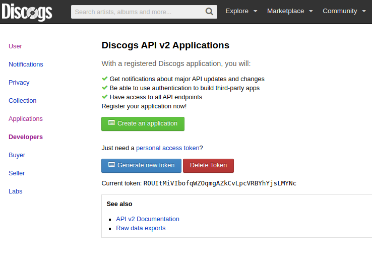
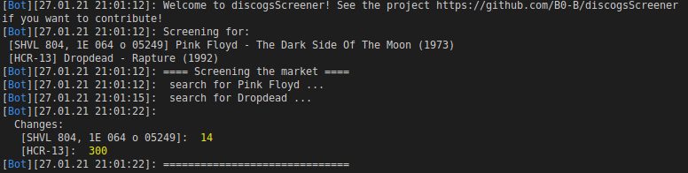

# discogsScreener

## Setup
### 1.)
Within the discogs account under `Settings > Developers` create a personal access token (API) and copy it
<br>


### 2.)
Open the `config.yml` and paste the token and your mail address:
```yaml
credentials:

  token: 'ROUItMiVIbofqWZOqmgAZkCvLpcVRBYhYjsLMYNc'
  mailReceiver: # ADD YOUR MAIL ADDRESS WHERE TO RECEIVE!
  mailSender: # ADD YOUR MAIL ADDRESS WHERE TO SEND FROM!
  senderPassword: # SENDER PASSWORD
...
```
and save it.

### 3.) Start
```python
$ python discogsScreener.py
```

### 4.) Result


The bot in the above screenshot has found 14 changes for the first cat and 300 for the second cat number. Each change (containing cat number, discogs-release-number) are sent to the user via mail and will be dropped persistently in a local json-database.